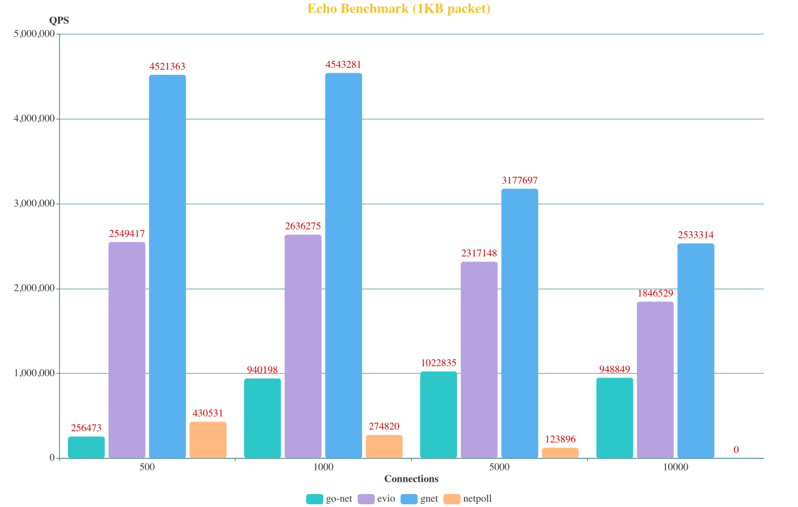
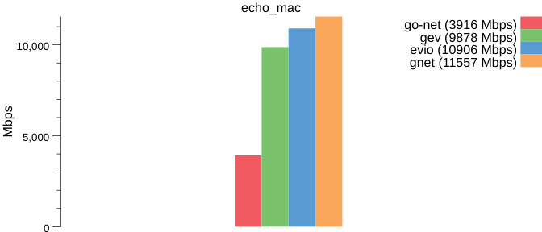
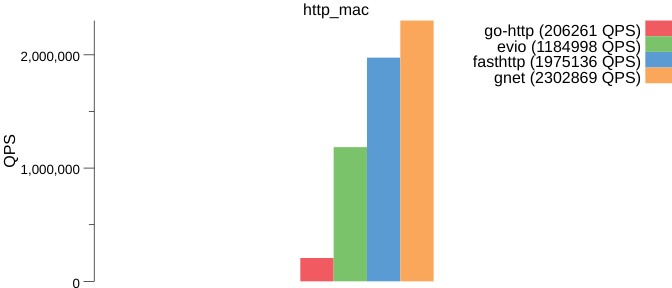

## gnet benchmark tools

Required tools:

- [wrk](https://github.com/wg/wrk) for HTTP
- [tcpkali](https://github.com/machinezone/tcpkali) for Echo

Required Go packages:

```
go get gonum.org/v1/plot/...
go get -u github.com/valyala/fasthttp
```

And of course [Go](https://golang.org) is required.

Run `bench.sh` for all benchmarks.

## Notes

- The current results were run on both Linux and FreeBSD.
- The servers started in multiple-threaded mode (GOMAXPROCS=Default).
- Network clients connected over Ipv4 localhost.

Like all benchmarks ever made in the history of whatever, YMMV. Please tweak and run in your environment and let me know if you see any glaring issues.

# Benchmark Test

## On Linux (epoll)

### Test Environment

```powershell
# Machine information
        OS : Ubuntu 20.04/x86_64
       CPU : 8 Processors, AMD EPYC 7K62 48-Core Processor
    Memory : 16.0 GiB

# Go version and settings
Go Version : go1.15.7 linux/amd64
GOMAXPROCS : 8

# Netwokr settings
TCP connections : 300
Test duration   : 30s
```
### Contrast of the similar networking libraries:

#### Echo Server


#### HTTP Server


## On FreeBSD (kqueue)

### Test Environment

```powershell
# Machine information
        OS : macOS Catalina 10.15.7/x86_64
       CPU : 6-Core Intel Core i7
    Memory : 16.0 GiB

# Go version and configurations
Go Version : go version go1.15.7 darwin/amd64
GOMAXPROCS : 12

# Netwokr settings
TCP connections : 100
Test duration   : 20s
```

#### Echo Server



#### HTTP Server



